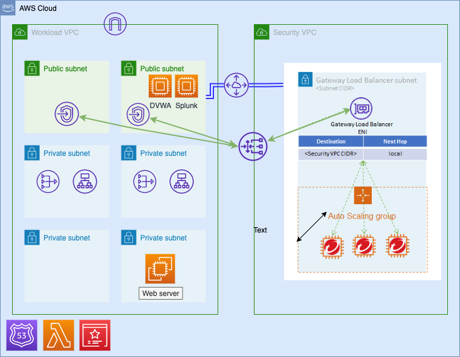

# centralized-deployment-with-gwlb

## Purpose and Objectives

This Quick Start deploys a security VPC with Apache web server for inbound traffic inspection. It also deploys Damn Vulnerable Web Application (DVWA) in one of the public subnets. The purpose of this quickstart is to provide users a sample environment where they can deploy Network Security Virtual Appliance to protect their resources from inbound internet traffic. In this deployment, we use Gateway Load Balancer to route traffic to Network Security Appliance.

After deploying this Quick Start, you will be able to:

- Deploy Network Security Virtual Appliance (NSVA) as [Centralized Inbound Protection](https://cloudone.trendmicro.com/docs/network-security/GWLB_CFdeploy1/)
- Configure your security profile in Network Security console by distributing various Intrustion Prevention (IPS), Geo Filters to prevent your resources from inbound attacks
- Perform various inbound and outbound attacks to validate protection.
- Access logs of Network Security Virtual Applicance (NSVA) to verify which filters are getting triggered.
## Network Architecture

## Deployment Steps

*Note: You can deploy this Quick Start using the default S3 template link below if you don't wish to make changes to this code and deploy with your own customized changes:*

`https://quickstart-network-security.s3.us-west-1.amazonaws.com/centralized-with-gwlb/templates/Master.yaml`
### 1. Deploy Network Security with Centralized Security VPC
The Quick Start offers two deployment options:

- Deploying Network Security with centralized security VPC without High Availability
- Deploying Network Security with centralized security VPC with High Availability

Following are pre-requisites that must be fulfilled before you could deploy the Quick Start:
- Create a new SSH key pair in the AWS region you will be deploying the Quick Start
- [Generate a CloudOne API Key](https://cloudone.trendmicro.com/docs/network-security/add_cloud_accounts_appliances/#generate-an-api-key)

Below are the parameters for Quick Start:
#### Quick Start Parameters

##### Required parameters
| Parameter label (name) | Default        | Description                                                    |
| :----------------------| :------------- | :------------------------------------------------------------- |
| AllowIP    | 127.0.0.1/32   | Only the IP entered here will be able to access the web server |
| BucketName | quickstart-network-security   | Name of the bucket where the template is placed |
| BucketPrefix    | centralized-with-gwlb/ | Bucket prefix |
| BucketRegion    | us-west-1| Bucket region |
| DVWAInstanceType | t3.micro | Amazon EC2 instance type for the DVWA instances |
| sshKeyPairName  | None| [Required: 'DeployC1NS' must be set to true] SSH Key of the EC2 you are using |
| SSMAccess    | true | If enabled, SSM access to the instance will be available |
| DeployHTTPS    | false | If enabled, The HTTPS site will be deployed |
| DeployC1NS    | true | If enabled, C1NS with be deployed in centralized Security VPC |
| DeployC1NSHA    | false | [KEEP IT to 'false', DOESN'T WORK CURRENTLY] If enabled, C1NS will be deployed in centralized Security VPC |
| DeploySplunk    | false | [Required: 'DeployC1NS' must be set to true] If enabled, Splunk Server will be deployed |

##### If you set the DeployHTTPS parameter to true, the following parameters are required
| Parameter label (name) | Default        | Description                                                    |
| :----------------------| :------------- | :------------------------------------------------------------- |
| DomainName    | None | Domain name to be used for the website |
| SubDomain    | None | Subdomain to be used for the ALB. |
| HostZoneID    | None | ID of the HostZone where the domain you want to use is registered. The domain name to be used must be registered in Route53's HostZone. If you have not already done so, please create a new HostZone and register your domain. The HostZone must be public |

##### If you set the DeployC1NS parameter to true, the following parameters are required
| Parameter label (name) | Default        | Description                                                    |
| :----------------------| :------------- | :------------------------------------------------------------- |
| CloudOneAPIKEY  | None | CloudOne API key you want to use |
| InstanceType  | c5n.2xlarge | Instance type of NSVA |
| SecurityVPCCIDR | 10.10.10.0/16 | CIDR of the VPC where you want to deploy the NSVA |
| NsvaCountPerAz  | 1 | Number of NSVA instances to be deployed in the AZ |
| EnableInspectionLogs  | false | If enabled, NSVA Inspection Logs will be published to CloudWatch log group "network_security_logs" |

##### If you set the DeploySplunk parameter to true, the following parameters are required
| Parameter label (name) | Default        | Description                                                    |
| :----------------------| :------------- | :------------------------------------------------------------- |
| SyslogPort  | 5140 | Port number used by Splunk Server |
| SplunkPassword  | None | Password used by Splunk Server |
| SplunkVersion  | 8.2 | Splunk Version |

## Performing IPS and SQL Attacks

Before performing each attack, please perform the following steps:
1. Configure respective filter to Block and Log mode in Trend Micro Cloud One console. For detailed steps please check [Customize filter settings using the GUI](https://cloudone.trendmicro.com/docs/network-security/Customize_filter_settings_GUI/)
2. Distribute profile with filter overrides. For detailed steps please check [Distribute filter overrides to your network](https://cloudone.trendmicro.com/docs/network-security/Filter_overrides_GUI/)

### SQL Attacks

SQL Attacks can be performed on DVWA server that is spun up as part of the Quick Start. In order to perform SQL Attacks, you wil need to first configure the application security level to "Low" in order for attacks to work properly. This can be done as follows:

1. Login to DVWA application from your browser. You can retrieve the DVWAPublicIP from the "Output" tab of your DVWA CloudFormation stack. The URL would be `http://<DVWAPublicIP>`
2. Login to Web Application using following default credentials
    Username: `admin`
    Password: `password`
3. Go to DVWA Security menu on the side navigation panel
4. Set Security Level to "Low" and hit Submit button

Below are some SQL attacks you can perform on your DVWA server

| Filter ID  | Attack                                                        |
| :--------- | :------------------------------------------------------------ |
| 3593      | 1. Go to SSL Injection menu on the side navigation panel 2. Enter `?id=a' UNION SELECT "text1","text2";-- -&Submit=Submit` in "User ID" text box and hit submit |
| 12365      | On your browser, enter `http://<DVWAPublicIP>/vulnerabilities/xss_d/?default=English%3Cscript%3Ealert(1)%3C/script%3E` |

### Inbound Attacks

Inbound attacks could be performed on any publicly accessible webserver. In this case, we can perform a simple Shell Shock attack on our DVWA or Web Server created

| Filter ID  | Attack                                                             |
| :--------- | :----------------------------------------------------------------- |
| 16798      | `curl -H "User-Agent: () { :; }; /bin/eject" http://<WebServerALBHostname>` |
