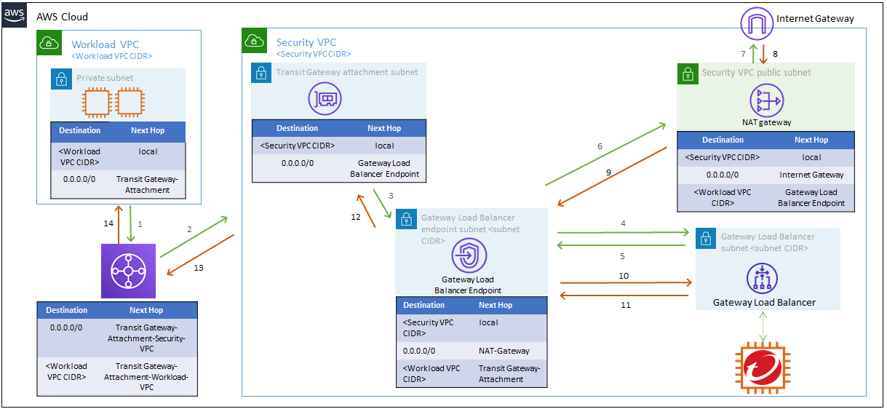

# east-west-deployment
## Purpose and Objectives

This Quick Start deploys attacker, victim and security VPC to demonstrate outbound protection with Network Security Appliance. It also deploys Damn Vulnerable Web Application (DVWA) in one of the public subnets on victim VPC. The purpose of this quickstart is to provide users a sample environment where they can deploy Network Security Virtual Appliance for east-west/ lateral traffic between various workload VPCs using Transit Gateway. In this deployment, we use Gateway Load Balancer and Transit Gateway to route traffic to Network Security Appliance.

After deploying this Quick Start, you will be able to:

- Deploy Network Security Virtual Appliance (NSVA) as [East-West Outbound Protection](https://cloudone.trendmicro.com/docs/network-security/GWLB_CFdeploy2/)
- Configure your security profile in Network Security console by distributing various Intrustion Prevention (IPS), Geo Filters to prevent your resources from outbound attacks.
- Perform various inbound and outbound attacks to validate protection.
- Access logs of Network Security Virtual Applicance (NSVA) to verify which filters are getting triggered.
## Network Architecture

## Deployment Steps

*Note: You can deploy this Quick Start using the default S3 template link below if you don't wish to make changes to this code and deploy with your own customized changes:*

`https://quickstart-network-security.s3.us-west-1.amazonaws.com/east-west-deployment/templates/Master.yaml`
### 1. Deploy Network Security East West Outbound Only Inspection
The Quick Start deploys Security VPC for East West Outbound Only inspection in multiple AZs using Transit Gateways. Users are expected to deploy attacker and victim VPCs manually (instructions are given below)

Following are pre-requisites that must be fulfilled before you could deploy the Quick Start:
- Create a new SSH key pair in the AWS region you will be deploying the Quick Start
- [Generate a CloudOne API Key](https://cloudone.trendmicro.com/docs/network-security/add_cloud_accounts_appliances/#generate-an-api-key)

Below are the parameters for Quick Start:
#### Quick Start Parameters
##### Required parameters
| Parameter label (name) | Default        | Description                                                    |
| :----------------------| :------------- | :------------------------------------------------------------- |
| AllowIP    | 127.0.0.1/32   | Only the IP entered here will be able to access the web server |
| BucketName | quickstart-network-security   | Name of the bucket where the template is placed |
| BucketPrefix    | centralized-with-gwlb/ | Bucket prefix |
| BucketRegion    | us-west-1| Bucket region |
| DVWAInstanceType | t3.micro | Amazon EC2 instance type for the DVWA instances |
| sshKeyPairName  | None| [Required: 'DeployC1NS' must be set to true] SSH Key of the EC2 you are using |
| SSMAccess    | true | If enabled, SSM access to the instance will be available |
| DeployC1NS    | true | If enabled, C1NS with be deployed in centralized Security VPC |

##### If you set the DeployC1NS parameter to true, the following parameters are required
| Parameter label (name) | Default        | Description                                                    |
| :----------------------| :------------- | :------------------------------------------------------------- |
| CloudOneAPIKEY  | None | CloudOne API key you want to use |
| InstanceType  | c5n.2xlarge | Instance type of NSVA |
| SecurityVPCCIDR | 10.10.10.0/16 | CIDR of the VPC where you want to deploy the NSVA |
| NsvaCountPerAz  | 1 | Number of NSVA instances to be deployed in the AZ |
| EnableInspectionLogs  | false | If enabled, NSVA Inspection Logs will be published to CloudWatch log group "network_security_logs" |